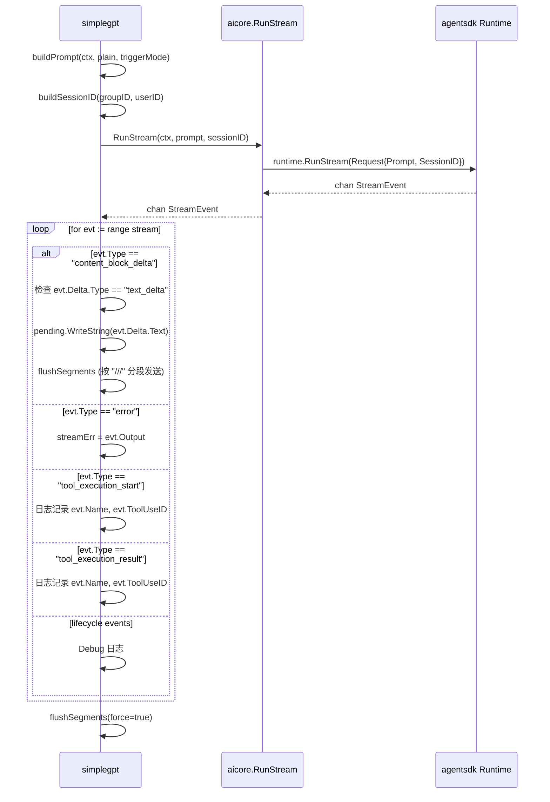

现在我有了完整的信息。让我详细说明 gRPC 接口应该如何设计。

---

## simplegpt 调用链分析

先梳理 simplegpt 当前消费 `aicore` 的完整数据流：



## simplegpt 实际使用的字段

从 `streamReply` 函数（第 172-221 行）逐行提取，simplegpt 真正读取的 `StreamEvent` 字段是：

| 事件类型 | 读取的字段 | 用途 |
|---------|-----------|------|
| `content_block_delta` | `evt.Delta.Type`（必须为 `"text_delta"`）、`evt.Delta.Text` | 拼接文本，按 `///` 分段发送给 QQ |
| `error` | `evt.Output`（转为 error 字符串） | 记录错误 |
| `tool_execution_start` | `evt.Name`、`evt.ToolUseID` | 仅日志 |
| `tool_execution_result` | `evt.Name`、`evt.ToolUseID` | 仅日志 |
| 其他 lifecycle 事件 | `evt.Type`（仅用于 Debug 日志） | 仅日志 |

另外还有两个关键行为：
1. **channel 关闭**代表流结束（`for evt := range stream`）
2. **`sentCount == 0`** 判定为空响应错误

## gRPC 接口设计

基于以上分析，Omoi 的 `ChatStream` 接口只需要传递 simplegpt 实际消费的信息即可：

```protobuf
syntax = "proto3";
package omoi.v1;
option go_package = "github.com/colanns/Omoi/proto/omoiv1";

service OmoiService {
  rpc ChatStream(ChatStreamRequest) returns (stream ChatStreamEvent);
}

// --- ChatStream ---

message ChatStreamRequest {
  string prompt = 1;
  string session_id = 2;
}

message ChatStreamEvent {
  // 事件类型，对应 agentsdk-go 的 StreamEvent.Type
  // 简化为 simplegpt 实际关心的 5 类
  EventType type = 1;

  // text_delta 事件：增量文本片段
  string text = 2;

  // error 事件：错误描述
  string error = 3;

  // tool 事件：工具名和调用 ID（仅供日志）
  string tool_name = 4;
  string tool_use_id = 5;
}

enum EventType {
  EVENT_TYPE_UNSPECIFIED = 0;
  EVENT_TYPE_TEXT_DELTA = 1;           // 对应 content_block_delta + text_delta
  EVENT_TYPE_ERROR = 2;               // 对应 error
  EVENT_TYPE_TOOL_EXECUTION_START = 3; // 对应 tool_execution_start
  EVENT_TYPE_TOOL_EXECUTION_RESULT = 4;// 对应 tool_execution_result
  EVENT_TYPE_LIFECYCLE = 5;           // 合并所有 lifecycle 事件
}
```

### 设计要点解释

**为什么只需要这 5 个字段？**

从 simplegpt 的 `streamReply` 可以看出：

```go
// 第 193-209 行，simplegpt 只关心这几种分支：
case api.EventContentBlockDelta:
    // 只取 evt.Delta.Text -> 对应 gRPC 的 text 字段
case api.EventError:
    // 只取 evt.Output -> 对应 gRPC 的 error 字段
case api.EventToolExecutionStart:
    // 只取 evt.Name, evt.ToolUseID -> 对应 tool_name, tool_use_id
case api.EventToolExecutionResult:
    // 同上
default (lifecycle):
    // 只取 evt.Type 打日志 -> 对应 EVENT_TYPE_LIFECYCLE
```

agentsdk-go 的 `StreamEvent` 结构体有 13 个字段（`Message`、`Index`、`ContentBlock`、`Delta`、`Usage`、`ToolUseID`、`Name`、`Output`、`IsStderr`、`IsError`、`SessionID`、`Iteration`、`TotalIter`），但 simplegpt **实际只读取了 4 个**：`Delta.Text`、`Output`、`Name`、`ToolUseID`。gRPC 接口不需要传递其余字段。

**关键简化：已将 `content_block_delta` + `Delta.Type == "text_delta"` 的二次判断合并**

原始 agentsdk 的流程是：先匹配 `EventContentBlockDelta`，再检查 `evt.Delta != nil && evt.Delta.Type == "text_delta"`。在 Omoi 的 gRPC server 端做这个过滤，只在确实是 text_delta 时才发送 `EVENT_TYPE_TEXT_DELTA` 事件，客户端不再需要二次判断。

### Omoi Server 端的映射逻辑

```go
// Omoi internal/server/handler.go
func (s *Server) ChatStream(req *omoiv1.ChatStreamRequest, stream omoiv1.OmoiService_ChatStreamServer) error {
    ch, err := aicore.RunStream(stream.Context(), req.Prompt, req.SessionId)
    if err != nil {
        return status.Errorf(codes.Internal, "run stream: %v", err)
    }

    for evt := range ch {
        var msg *omoiv1.ChatStreamEvent

        switch evt.Type {
        case api.EventContentBlockDelta:
            if evt.Delta == nil || evt.Delta.Type != "text_delta" || evt.Delta.Text == "" {
                continue  // 在 server 端过滤，客户端不需要关心
            }
            msg = &omoiv1.ChatStreamEvent{
                Type: omoiv1.EVENT_TYPE_TEXT_DELTA,
                Text: evt.Delta.Text,
            }

        case api.EventError:
            msg = &omoiv1.ChatStreamEvent{
                Type:  omoiv1.EVENT_TYPE_ERROR,
                Error: fmt.Sprintf("%v", evt.Output),
            }

        case api.EventToolExecutionStart:
            msg = &omoiv1.ChatStreamEvent{
                Type:      omoiv1.EVENT_TYPE_TOOL_EXECUTION_START,
                ToolName:  evt.Name,
                ToolUseId: evt.ToolUseID,
            }

        case api.EventToolExecutionResult:
            msg = &omoiv1.ChatStreamEvent{
                Type:      omoiv1.EVENT_TYPE_TOOL_EXECUTION_RESULT,
                ToolName:  evt.Name,
                ToolUseId: evt.ToolUseID,
            }

        default:
            msg = &omoiv1.ChatStreamEvent{
                Type: omoiv1.EVENT_TYPE_LIFECYCLE,
            }
        }

        if err := stream.Send(msg); err != nil {
            return err
        }
    }
    return nil  // stream 正常关闭
}
```

### Gokohime 客户端的消费方式

改造后的 `simplegpt/streamReply` 变成：

```go
func streamReply(ctx *zero.Ctx, prompt, sessionID string) error {
    timeout := 2 * time.Minute
    runCtx, cancel := context.WithTimeout(context.Background(), timeout)
    defer cancel()

    stream, err := omoiclient.Get().ChatStream(runCtx, prompt, sessionID)
    if err != nil {
        return err
    }

    var pending strings.Builder
    sentCount := 0
    var streamErr error

    for {
        evt, err := stream.Recv()
        if err == io.EOF {
            break  // 流结束，等价于原来的 channel 关闭
        }
        if err != nil {
            return fmt.Errorf("stream recv: %w", err)
        }

        switch evt.Type {
        case omoiv1.EVENT_TYPE_TEXT_DELTA:
            // 直接拼接，不需要再判断 Delta.Type
            pending.WriteString(evt.Text)
            sentCount += flushSegments(ctx, &pending, false)

        case omoiv1.EVENT_TYPE_ERROR:
            streamErr = fmt.Errorf("%s", evt.Error)

        case omoiv1.EVENT_TYPE_TOOL_EXECUTION_START:
            log.Infof("[simplegpt] tool start session=%s tool=%s id=%s",
                sessionID, evt.ToolName, evt.ToolUseId)

        case omoiv1.EVENT_TYPE_TOOL_EXECUTION_RESULT:
            log.Infof("[simplegpt] tool result session=%s tool=%s id=%s",
                sessionID, evt.ToolName, evt.ToolUseId)

        case omoiv1.EVENT_TYPE_LIFECYCLE:
            log.Debugf("[simplegpt] lifecycle event session=%s", sessionID)
        }
    }

    sentCount += flushSegments(ctx, &pending, true)
    if streamErr != nil {
        return streamErr
    }
    if sentCount == 0 {
        return fmt.Errorf("empty agent response")
    }
    return nil
}
```

### 与原代码的逐行对应

| 原 simplegpt 代码 | 改造后 | 变化点 |
|---|---|---|
| `aicore.RunStream(ctx, prompt, sessionID)` 返回 `<-chan api.StreamEvent` | `omoiclient.Get().ChatStream(ctx, prompt, sessionID)` 返回 gRPC stream | channel -> gRPC stream |
| `for evt := range stream` | `for { evt, err := stream.Recv(); if err == io.EOF { break } }` | Go channel 迭代 -> gRPC Recv 循环 |
| `evt.Delta.Type != "text_delta"` 判断 | 不需要，server 端已过滤 | 逻辑上移到 Omoi |
| `evt.Delta.Text` | `evt.Text` | 扁平化字段 |
| `fmt.Sprintf("%v", evt.Output)` | `evt.Error` | 已在 server 端格式化 |
| `evt.Name` / `evt.ToolUseID` | `evt.ToolName` / `evt.ToolUseId` | 字段名微调 |
| `aicore.GetRuntime() == nil` 检查 | gRPC 连接检查（由 omoiclient 封装） | 健康检查方式变化 |
| `buildPrompt` / `buildSessionID` / session lock | **不变**，仍在 simplegpt 内 | 这些逻辑与 AI 无关 |
| `flushSegments` | **不变** | 纯文本处理逻辑 |

总结：gRPC 接口设计的核心原则是**在 Omoi server 端做 agentsdk StreamEvent 到简化 protobuf 消息的映射**，让 Gokohime 客户端不再需要依赖 agentsdk-go 的类型定义。simplegpt 的改动量很小——只替换流的获取方式和事件字段名，其余逻辑（prompt 构建、session lock、`///` 分段发送）完全不动。