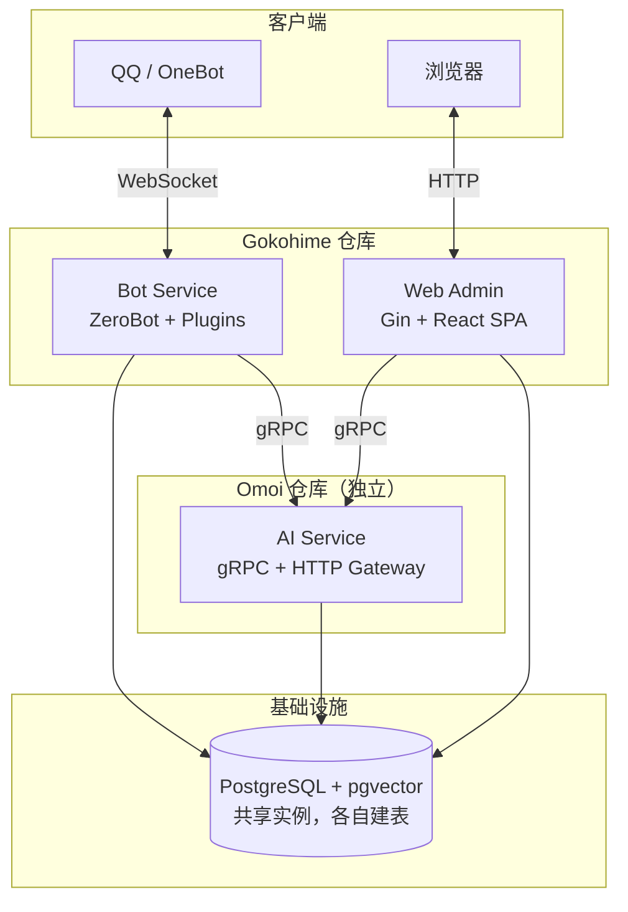
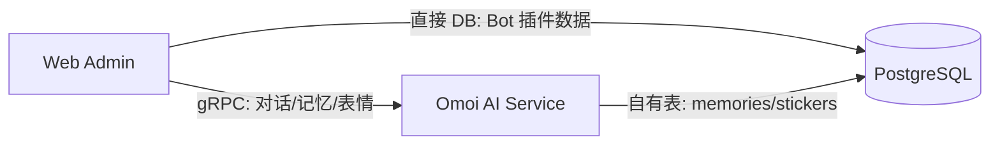
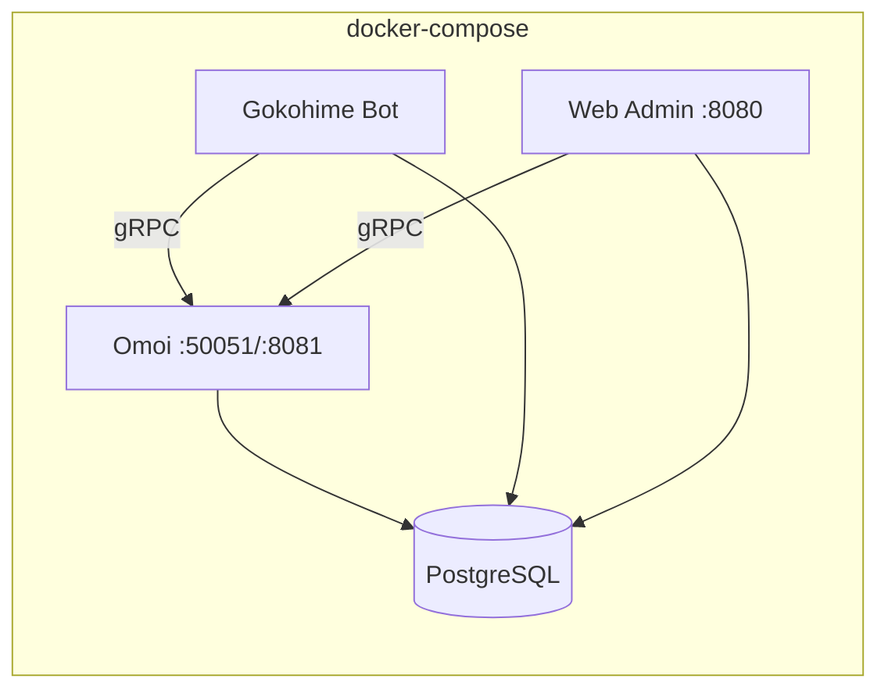

# Gokohime Web 管理端 + Omoi AI 服务拆分方案

## 现状分析

当前 Gokohime 是一个**单体进程** QQ 机器人：

- `main.go` 同时初始化 DB、AI Runtime、ZeroBot，全部跑在一个进程里
- AI 逻辑封装在 `internal/aicore`（基于 agentsdk-go），通过全局单例 `runtime` 调用
- 15 个 plugin 通过 `init()` 自注册到 ZeroBot
- 数据库 PostgreSQL + pgvector，通过 GORM 全局 `database.Get()` 访问
- 没有 HTTP API 层，没有 Web 前端

---

## 目标架构

拆分为两个仓库、三个可独立部署的组件：



---

## 一、Omoi - 独立 AI Service 仓库

新建 `github.com/colanns/Omoi` 仓库，将所有 AI 相关代码和数据从 Gokohime 中剥离。

### 1.1 从 Gokohime 迁移的内容

以下代码和数据模型**完整移入 Omoi**，从 Gokohime 中**删除**：

- `internal/aicore/runtime.go` - Agent Runtime 封装
- `internal/aicore/middleware.go` - 日志中间件
- `internal/aicore/tools/weather.go` - 天气工具
- `internal/aicore/tools/websearch.go` - 搜索工具
- `internal/aicore/tools/memory_recall.go` - 记忆回忆工具
- `internal/aicore/tools/memory_store.go` - 记忆存储工具
- `internal/aicore/tools/sticker.go` - 表情搜索/分析工具
- 数据库模型：`Memory`、`Sticker`、`UserProfile`（仅被 AI tools 使用）
- `.agents/rules/personality.md` - 人设规则文件
- 配置项：`AIConfig`、`EmbeddingConfig`、`WeatherConfig`、`SearchConfig`

### 1.2 Omoi 仓库结构

```
github.com/colanns/Omoi/
  cmd/
    omoi/main.go                  # 服务入口
  internal/
    aicore/                       # 从 Gokohime 迁移，保持原样
      runtime.go
      middleware.go
    tools/                        # 从 Gokohime aicore/tools 迁移
      weather.go
      websearch.go
      memory_recall.go
      memory_store.go
      sticker.go
      common.go
    database/
      db.go                       # DB 初始化（仅 AI 相关表）
      models.go                   # Memory, Sticker, UserProfile
    config/
      config.go                   # Omoi 专用配置
    server/
      grpc.go                     # gRPC server 启动/关闭
      handler.go                  # RPC 接口实现
  proto/
    omoi/v1/
      omoi.proto                  # Protobuf 服务定义
  rules/                          # 人设规则（从 .agents/rules/ 迁移）
    personality.md
  config.example.yaml
  Dockerfile
  Makefile
  go.mod                          # module github.com/colanns/Omoi
```

### 1.3 Proto 定义（核心接口）

```protobuf
syntax = "proto3";
package omoi.v1;

service OmoiService {
  // 对话
  rpc Chat(ChatRequest) returns (ChatResponse);
  rpc ChatStream(ChatRequest) returns (stream ChatStreamEvent);

  // Session 管理
  rpc ListSessions(ListSessionsRequest) returns (ListSessionsResponse);
  rpc GetSession(GetSessionRequest) returns (GetSessionResponse);
  rpc ClearSession(ClearSessionRequest) returns (ClearSessionResponse);

  // 记忆管理（供 Web Admin 使用）
  rpc ListMemories(ListMemoriesRequest) returns (ListMemoriesResponse);
  rpc GetMemory(GetMemoryRequest) returns (GetMemoryResponse);
  rpc CreateMemory(CreateMemoryRequest) returns (CreateMemoryResponse);
  rpc UpdateMemory(UpdateMemoryRequest) returns (UpdateMemoryResponse);
  rpc DeleteMemory(DeleteMemoryRequest) returns (DeleteMemoryResponse);
  rpc SearchMemories(SearchMemoriesRequest) returns (SearchMemoriesResponse);

  // 表情管理（供 Web Admin 使用）
  rpc ListStickers(ListStickersRequest) returns (ListStickersResponse);
  rpc DeleteSticker(DeleteStickerRequest) returns (DeleteStickerResponse);

  // 健康检查
  rpc HealthCheck(HealthCheckRequest) returns (HealthCheckResponse);
}

message ChatRequest {
  string prompt = 1;
  string session_id = 2;
  map<string, string> metadata = 3;
}

message ChatStreamEvent {
  string type = 1;    // "text_delta", "tool_start", "tool_result", "error", "done"
  string text = 2;
  string tool_name = 3;
  string tool_id = 4;
}
```

### 1.4 关键设计

- **gRPC + grpc-gateway**：gRPC 供 Bot 内部调用（低延迟），grpc-gateway 暴露 REST 端点供调试或 Web Admin 直接 HTTP 调用
- **自有数据库表**：Omoi 管理 `memories`、`stickers`、`user_profiles` 三张表，AutoMigrate 只迁移这三个模型
- **共享 PostgreSQL 实例**：与 Gokohime 连同一个数据库（不同的表），部署时通过同一个 `DATABASE_URL` 配置
- **Tools 完全自包含**：天气、搜索、记忆、表情工具全部在 Omoi 内，不依赖外部服务（除第三方 API）
- **人设规则热加载**：`rules/` 目录下的 Markdown 文件由 agentsdk-go 的 Agent 规则机制加载

### 1.5 Omoi 配置

```yaml
# config.yaml
ai:
  model: "claude-sonnet-4-20250514"
  anthropic_api_key: ""
  openai_api_key: ""
  openai_api_base: ""
  openai_model: ""
  auto_compact: true
  compact_threshold: 0.8
  compact_preserve_count: 4

database:
  url: "postgres://..."

embedding:
  model: "text-embedding-3-small"
  dimensions: 512

weather:
  api_key: ""
  default_city: ""
  cache_ttl_min: 30

search:
  api_key: ""
  api_base: ""
  model: ""

server:
  grpc_listen: ":50051"
  http_listen: ":8081"
```

---

## 二、Gokohime 改造

### 2.1 移除的代码

- 删除整个 `internal/aicore/` 目录
- 从 `internal/database/models.go` 中移除 `Memory`、`Sticker`、`UserProfile`
- 从 `internal/database/db.go` 的 `AutoMigrate` 中移除对应模型和 HNSW 索引创建
- 从 `internal/config/config.go` 中移除 `AIConfig`、`EmbeddingConfig`、`WeatherConfig`、`SearchConfig`
- 删除 `.agents/rules/personality.md`

### 2.2 新增的代码

```
internal/
  omoiclient/
    client.go                    # gRPC client 封装
    stream.go                    # streaming helper
```

`omoiclient` 包装 Omoi gRPC client，提供与旧 `aicore` 相同风格的接口：

```go
// client.go 核心接口
type Client struct { conn *grpc.ClientConn; svc omoiv1.OmoiServiceClient }

func NewClient(addr string) (*Client, error)
func (c *Client) ChatStream(ctx context.Context, prompt, sessionID string) (<-chan StreamEvent, error)
func (c *Client) Close()
```

### 2.3 改造 main.go

改动点（对照当前 [main.go](main.go)）：

```go
// 删除这些 import
// "github.com/colanns/gokohime/internal/aicore"
// aicoreTools "github.com/colanns/gokohime/internal/aicore/tools"

// 新增 import
import "github.com/colanns/gokohime/internal/omoiclient"

// 删除 customTools、middlewares 构建和 aicore.InitRuntime（第 68-83 行）
// 替换为：
omoi, err := omoiclient.NewClient(cfg.AI.ServiceAddress)
if err != nil {
    log.Fatalf("[main] connect to Omoi: %v", err)
}
defer omoi.Close()
```

### 2.4 改造 plugin/simplegpt

[plugin/simplegpt/init.go](plugin/simplegpt/init.go) 改动：

- 移除 `import "github.com/colanns/gokohime/internal/aicore"`
- `streamReply` 函数中将 `aicore.RunStream(...)` 替换为 `omoiclient.Get().ChatStream(...)`
- 流事件类型从 `api.StreamEvent` 改为 `omoiclient.StreamEvent`（映射 gRPC stream）

### 2.5 配置变更

`config.yaml` 中 AI 相关配置缩减为一行连接地址：

```yaml
bot: { ... }
database: { ... }     # 保留（Bot 自己的表）
ai_service:
  address: "localhost:50051"
banana: { ... }
randpic: { ... }
repeater: { ... }
```

---

## 三、Web Admin 管理端（在 Gokohime 仓库中）

### 3.1 技术选型

- 后端框架：**Gin** -- Go 生态主流，轻量
- 前端框架：**React + Vite + Ant Design** -- 管理后台标配
- 认证：**JWT + 简单用户表** -- 初期够用
- API 风格：**RESTful JSON** -- 管理端标准

### 3.2 目录结构

```
cmd/
  admin/main.go                # Web Admin 入口（独立进程）
internal/
  admin/
    router.go                  # Gin 路由
    middleware/
      auth.go                  # JWT
      cors.go
    handler/
      conversation.go          # 对话管理 -> 调 Omoi gRPC
      database.go              # 数据库管理（预留）
      memory.go                # 记忆管理 -> 调 Omoi gRPC
      sticker.go               # 表情管理 -> 调 Omoi gRPC
      plugin.go                # 插件管理（预留）
      system.go                # 系统状态
    model/
      admin_user.go            # 管理员表
web/
  admin/                       # React SPA
    src/pages/
      Dashboard.tsx
      Conversations.tsx
      Memories.tsx
      Stickers.tsx
      Database.tsx             # 预留
      Plugins.tsx              # 预留
      Settings.tsx
```

### 3.3 Web Admin 与 Omoi 的关系

Web Admin 通过 gRPC（或 grpc-gateway 的 HTTP 端点）调用 Omoi 的记忆/表情/对话管理接口。Bot 自身的数据（DailyLuck、CPStory、MealEntry 等）由 Web Admin 直接查数据库。



### 3.4 API 路由设计

```
POST   /api/auth/login
GET    /api/auth/me

# 以下通过 Omoi gRPC 代理
GET    /api/conversations
GET    /api/conversations/:id
DELETE /api/conversations/:id
POST   /api/conversations/:id/chat

GET    /api/memories
GET    /api/memories/:id
POST   /api/memories
PUT    /api/memories/:id
DELETE /api/memories/:id
POST   /api/memories/search

GET    /api/stickers
DELETE /api/stickers/:id

# 直接查 Gokohime DB
GET    /api/system/health
GET    /api/system/config
GET    /api/system/stats

# 预留
GET    /api/database/tables
GET    /api/database/tables/:name
GET    /api/plugins
PUT    /api/plugins/:name/config
```

---

## 四、数据库表归属

拆分后两个服务共享同一个 PostgreSQL 实例，但各自管理不同的表：

**Omoi 拥有的表**（AI Service 建表和迁移）：
- `memories` (+ HNSW 向量索引)
- `stickers` (+ HNSW 向量索引)
- `user_profiles`

**Gokohime 拥有的表**（Bot 建表和迁移）：
- `guess_game_sessions`
- `daily_lucks`、`daily_luck_templates`
- `plugin_data_files`、`plugin_binary_files`
- `migration_runs`
- `cp_stories`
- `meal_entries`
- `ktv_songs`
- `guess_song_catalogs`
- `rand_pic_items`
- `plugin_kvs`
- `admin_users`（Web Admin 新增）

---

## 五、部署方式



- Omoi 仓库自带 `Dockerfile` + `Makefile`
- Gokohime 仓库的 `docker-compose.yaml` 统一编排所有服务（Omoi 镜像从 registry 拉取或本地构建）
- 前端 SPA 由 Admin 进程的 Gin 托管静态文件

---

## 六、实施步骤

### Phase 1: 创建 Omoi 仓库并迁移 AI 代码
1. 新建 `github.com/colanns/Omoi` 仓库，初始化 `go.mod`
2. 将 `internal/aicore/`、`internal/aicore/tools/` 代码复制到 Omoi，调整 import 路径
3. 将 `Memory`、`Sticker`、`UserProfile` 模型移入 Omoi 的 `internal/database/`
4. 将 AI/Embedding/Weather/Search 配置移入 Omoi 的 `internal/config/`
5. 定义 `proto/omoi/v1/omoi.proto`，生成 Go 代码
6. 实现 gRPC Server（`internal/server/`），包装 aicore Runtime
7. 编写 `cmd/omoi/main.go` 入口
8. 用 `grpcurl` 或单元测试验证 Omoi 可独立运行

### Phase 2: 改造 Gokohime Bot
9. 新增 `internal/omoiclient/` gRPC client 包
10. 改造 `main.go`：移除 aicore 初始化，改为连接 Omoi
11. 改造 `plugin/simplegpt/`：用 omoiclient 替代 aicore
12. 从 Gokohime 删除 `internal/aicore/`、AI 相关模型和配置
13. 更新 `internal/database/db.go` 的 AutoMigrate 列表
14. 端到端测试 Bot + Omoi 联调

### Phase 3: Web Admin 后端（Gokohime 仓库内）
15. 搭建 Gin 框架 + JWT 认证
16. 实现对话/记忆/表情管理 API（代理 Omoi gRPC）
17. 实现系统状态 API
18. 预留数据库/插件管理路由

### Phase 4: Web Admin 前端
19. 初始化 React + Vite + Ant Design 项目
20. 实现登录 + 侧边栏布局
21. 实现核心管理页面
22. 预留空页面
